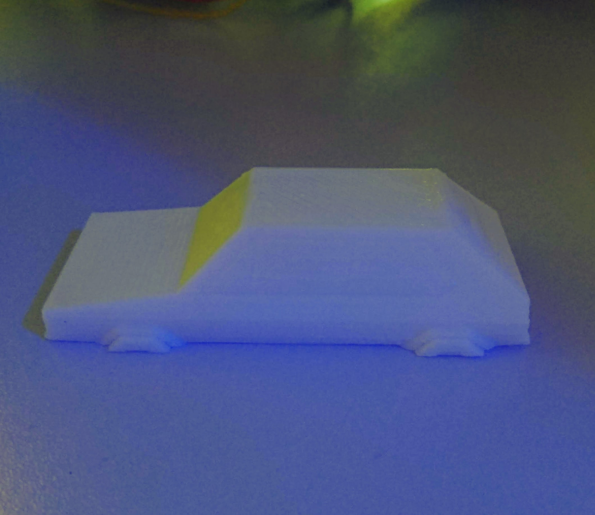
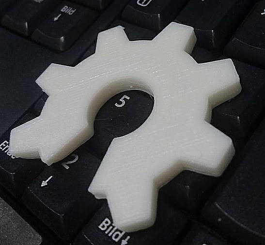

# Slic3r Configurations for the DSP Informatik AG 3D Printer

The following repository stores a set of configurations optimized for the DSP Informatik AG 3D Printer.

## Contents

- [Contents](#contents)
- [Downloading](#downloading)
- [Applying configuration files](#applying-configuration-files)
- [General Configuration Files](#general-configuration-files)
- [Model Configuration Files](#model-configuration-files)
	- [VW-Golf](#vw-golf)
	- [Open Hardware logo](#open-hardware-logo)

## Downloading

To download the configuration files, you may download this repository as a ZIP from [here](https://github.com/DSP-Informatik-AG/Slic3r-Configs/archive/master.zip), or clone this repository using `git`

```
git clone https://github.com/DSP-Informatik-AG/Slic3r-Configs.git
```

## Applying configuration files

To apply configuration files, use the `CTRL + L` shortcut, or select `File > Load Config...` from the top menubar. From there, select the desired configuration from your print.

## General Configuration Files

Due to the rather questionable choice of components used for our 3D printer, uncalibrated firmware and gcode will ultimately result it nothing but gibberish.

As a result, generalized configurations files, located in `general/`, have been provided in order to accomodate for range of print sizes:

**Sizes**

|File|Size|Reference Object|
|----|----|----------------|
|[DSP_InfoAG_3DPrinter_Config_S.ini](Slic3r-Configs/blob/master/general/DSP_InfoAG_3DPrinter_Config_S.ini)|Small|[10mm test cube](https://www.thingiverse.com/thing:56671)|
|[DSP_InfoAG_3DPrinter_Config_M.ini](Slic3r-Configs/blob/master/general/DSP_InfoAG_3DPrinter_Config_S.ini)|Medium|[20mm test cube](https://www.thingiverse.com/thing:56671)|

## Model Configuration Files

The following configuration files have been generated with a specific model in mind. The provided configuration files may be used as a reference point for simillar models.

> All model specific configs have been tested prior, and unless the printer firmware has been modified, should print successfully

### VW-Golf

[Model](https://www.thingiverse.com/thing:2133815) | [Configuration](VW_Golf/config.ini)

This configuration only supports printing without wheels :(



### Open Hardware logo

[Model](https://www.thingiverse.com/thing:8760) | [Configuration](OpenHW/config.ini)


